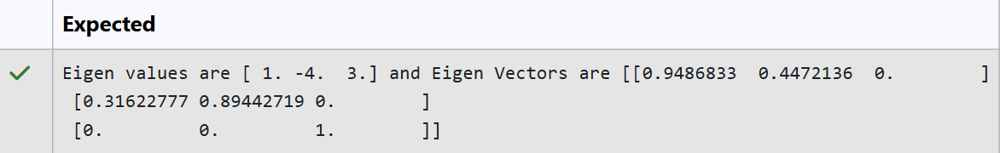
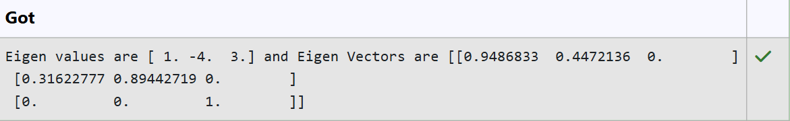

# EIGENVALUES-AND-EIGENVECTORS
## Aim:
To write a python program to find the Eigenvalues and Eigen Vectors
## Equipment’s required:
1. 	Hardware – PCs
2. 	Anaconda – Python 3.7 Installation / Moodle-Code Runner
## Algorithm:
### Step 1: Import the required NumPy library.

### Step 2: Define the matrix A.

### Step 3: Use numpy.linalg.eig() to find the eigenvalues and eigenvectors of the matrix.

### Step 4: Print the eigenvalues and eigenvectors.

## Program:
```
#Program to find the eigen values and eigen vectors.
#Developed by: Kalpesh C
#RegisterNumber: 212225230121
import os
os.environ["OPENBLAS_NUM_THREADS"]="1"
import numpy as np
A = np.array([[2, -3, 0],
              [2, -5, 0],
              [0, 0, 3]])
values, vectors = np.linalg.eig(A)
print("Eigen values are", values, "and Eigen Vectors are", vectors)
```

## Output:




## Result:
Thus the Eigenvalue and Eigenvector is successfully solved using python program
